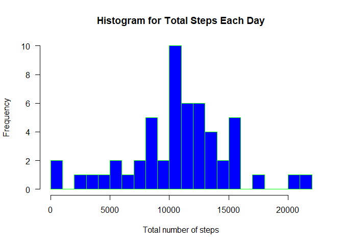
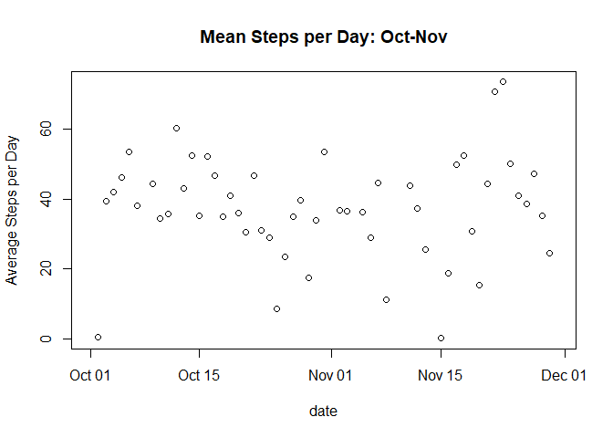
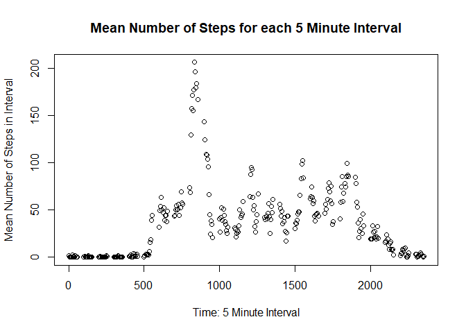
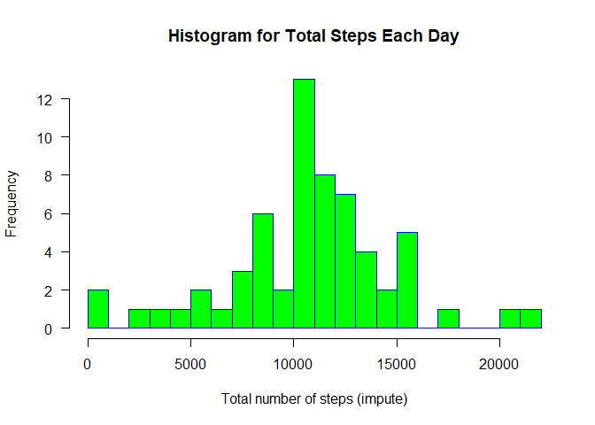
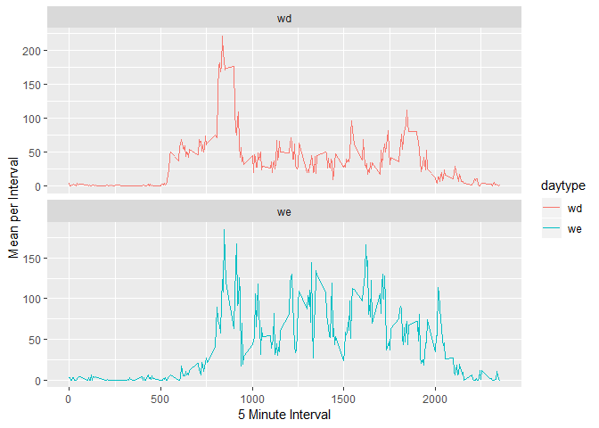

### 1. Loading and preprocessing the data

Show any code that is needed to Load the data (i.e. read.csv())

    library(readr)
    activity <- read_csv("activity.csv")

### 2. Process/transform the data (if necessary) into a format suitable for your analysis

What is mean total number of steps taken per day?

    intervalhm <- sprintf("%04d", activity$interval)
    intervalhm <- format(strptime(activity$intervalhm, format="%H%M"), format = "%H:%M")
    activity$time <- as.POSIXct(paste(activity$date, activity$intervalhm), format="%Y-%m-%d %H:%M")

    ## Sum, Mean and median of steps each day 
    sumstepday <- tapply(activity$steps, activity$date, sum)
    meanstep <- mean(sumstepday, na.rm=TRUE )
    medstep <- median(sumstepday,  na.rm=TRUE)

For this part of the assignment, you can ignore the missing values in
the dataset.

### 3. Make a histogram of the total number of steps taken each day

    hist(sumstepday,  
          main="Histogram for Total Steps Each Day", 
          xlab="Total number of steps", 
          border="green", 
          col="blue",
          xlim=c(0,22000),
          las=1, 
          breaks=20)

### 4. Calculate and report the mean and median total number of steps taken per day:

    meanstep

    ## [1] 10766.19

    medstep

    ## [1] 10765

### 5 What is the average daily activity pattern?

Make a time series plot (i.e. type = "l") of the 5-minute interval
(x-axis) and the average number of steps taken, averaged across all days
(y-axis)

    meanstepday <- tapply(activity$steps, activity$date, mean, na.rm=TRUE)
    date<-unique(activity$date)
    plot(date,meanstepday, ylab="Average Steps per Day", title(main="Mean Steps per Day: Oct-Nov"))

### 6. Which 5-minute interval, on average across all the days in the dataset, contains the maximum number of steps?

    intmean <- tapply(activity$steps, activity$interval, mean, na.rm=TRUE)
    int <- unique(activity$interval)
    intmean <- cbind(int, intmean)
    intmean <- as.data.frame(intmean)
    colnames(intmean) <- c("interval", "mean")
    plot(intmean$interval, intmean$mean, 
         xlab = "Time: 5 Minute Interval", 
         ylab = "Mean Number of Steps in Interval",
         main = "Mean Number of Steps for each 5 Minute Interval")

    intmean[which.max(intmean$mean),]

    ##     interval     mean
    ## 835      835 206.1698

### 7. Imputing missing values

Note that there are a number of days/intervals where there are missing
values (coded as NA). The presence of missing days may introduce bias
into some calculations or summaries of the data. Calculate and report
the total number of missing values in the dataset (i.e. the total number
of rows with NAs)

    percmiss <- function(x){sum(is.na(x))/length(x)*100}
    apply(activity,2,percmiss)

    ##     steps      date  interval      time 
    ##  13.11475   0.00000   0.00000 100.00000

    missdays <- tapply(activity$steps, activity$date ,percmiss)
    sum(missdays > 0)

    ## [1] 8

Devise a strategy for filling in all of the missing values in the
dataset. The strategy does not need to be sophisticated. For example,
you could use the mean/median for that day, or the mean for that
5-minute interval, etc. Create a new dataset that is equal to the
original dataset but with the missing data filled in.

    library(mice)
    temp <- activity[order(activity$interval, activity$date),]
    temp <- as.data.frame(temp)
    tempmice <- mice(temp,m=5,maxit=50,meth='pmm',seed=500)
    imputesteps <- complete(tempmice,1)

### 8.Make a histogram of the total number of steps taken each day:

    impsumstepday <- tapply(imputesteps$steps, imputesteps$date, sum)
    impmeanstep <- mean(impsumstepday, na.rm=TRUE )
    impmedstep <- median(impsumstepday,  na.rm=TRUE)
    ##Make a histogram of the total number of steps taken each day after imputing
    hist(impsumstepday,
          main="Histogram for Total Steps Each Day", 
          xlab="Total number of steps (impute)", 
          border="blue", 
          col="green",
          xlim=c(0,22000),
          las=1, 
          breaks=20)

### 9. Calculate and report the mean and median total number of steps taken per day:

    impmeanstep

    ## [1] 10704.49

    impmedstep

    ## [1] 10600

Do these values differ from the estimates from the first part of the
assignment? **Yes**

What is the impact of imputing missing data on the estimates of the
total daily number of steps? **It decreases both the mean and median**

### 10. Are there differences in activity patterns between weekdays and weekends?

For this part the weekdays() function may be of some help here. Use the
dataset with the filled-in missing values for this part. Create a new
factor variable in the dataset with two levels -- "weekday" and
"weekend" indicating whether a given date is a weekday or weekend day.
Make a panel plot containing a time series plot (i.e. type = "l") of the
5-minute interval (x-axis) and the average number of steps taken,
averaged across all weekday days or weekend days (y-axis).

    library("chron")
    imputesteps$weekend <- is.weekend(imputesteps$date)
    we <- with(imputesteps[imputesteps$weekend==TRUE, ], tapply(steps, interval, mean, na.rm=TRUE))
    wd <- with(imputesteps[imputesteps$weekend==FALSE, ], tapply(steps, interval, mean, na.rm=TRUE))

    temp2<- cbind(int,wd)
    temp2<-as.data.frame(temp2)
    temp2$type <- "wd"
    temp3<- cbind(int,we)
    temp3<-as.data.frame(temp3)
    temp3$type <- "we"

    colnames(temp2) <- c("int", "mean", "daytype")
    colnames(temp3) <- c("int", "mean", "daytype")
    wed2 <- rbind(temp2,temp3)

    library(ggplot2)
    ggplot(wed2, aes(int, mean)) +
                geom_line(aes(color = daytype)) +
                facet_wrap(~ daytype, scales = "free_y", ncol = 1)+
                ylab("Mean per Interval")+
                xlab("5 Minute Interval")

